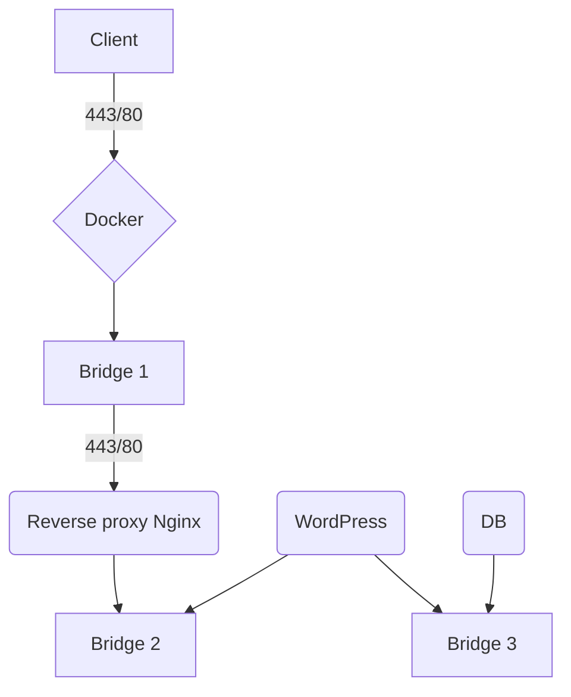

# Infrastructure scalable sous docker

Dans le cadre d'un cours de **devops** à l'IPI, je devais mettre en place une infrastructure **Docker** contenant un CMS.

Le cahier des charges de l'infrastructure est le suivant:

- Scalable
- Sécurisée
- Utilisation de TLS
- Persistence des données

