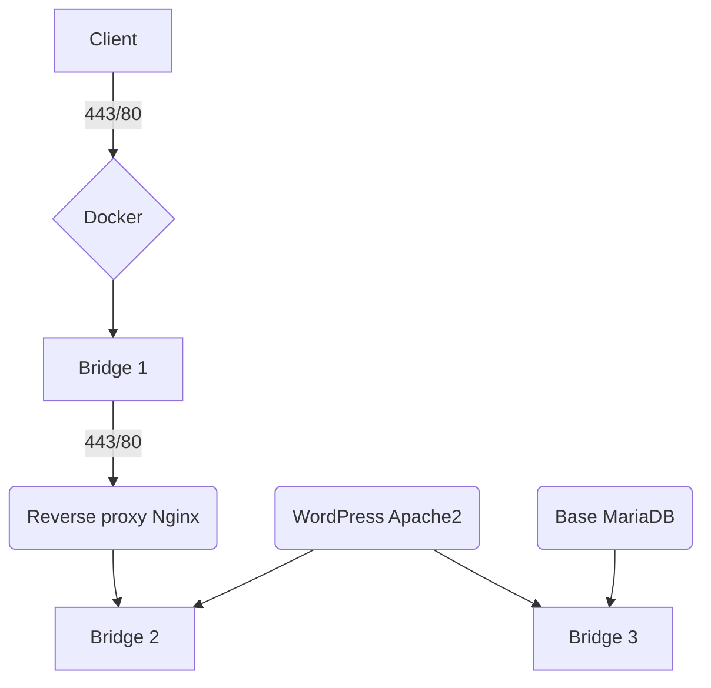

# Infrastructure scalable sous docker

Dans le cadre d'un cours de **devops** à l'IPI, je devais mettre en place une infrastructure **Docker** contenant un CMS.

Le cahier des charges de l'infrastructure est le suivant:

- Scalable

Pour la scalabilité j'ai simplement séparé les sources du site web dans un dossier public, ainsi que la conf apache dans le dossier cms, les logs du docker cms1 sons dans un dossier cms1, j'ai également mis en place un reverse proxy qui permet à l'avenir de pouvoir rendre l'infrastructure scalable.

- Sécurisée

Pour la sécurité j'ai mis en place trois sous-réseaux qui permettent de rajouter des couches de sécurité. Seul le port 443 et 80 sont ouverts vers l'extérieur et uniquement vers le reverse proxy. Les autres conteneurs ne sont donc pas exposés directement. De plus le reverse proxy ne communique pas directement avec la base car celle-ci est dans un autre sous réseau.

- Utilisation de TLS

Les échanges sont chiffrés de l'extérieur vers le reverse proxy 443 (le port 80 est redirigé vers le 443), pour le bon fonctionnement de Wordpress les échanges sont également chiffrés entre le reverse-proxy et l'instance cm.

- Persistence des données

Pour la persistance des données j'ai simplement attaché des volumes aux dockers :

    - MariaDB -> ```./db:/var/lib/mysql```
    - CMS -> ```./cms/public:/var/www/html/```

Et d'autres volumes consacrés aux fichiers de configuration disponibles dans le docker-compose.

